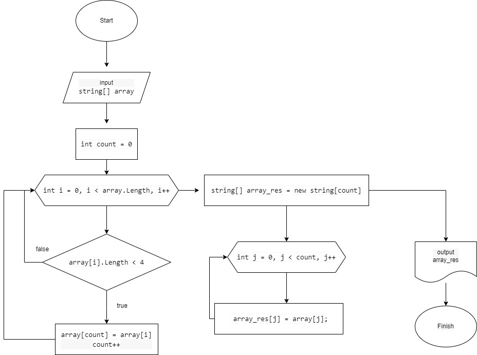

# Итоговая проверочная работа.
## Задача:
Написать программу, которая из имеющегося **массива строк** формирует массив из строк, длина которых меньше либо равна **3 символа**. 

Первоначальный массив можно ввести с клавиатуры, либо задать на старте выполнения алгоритма. 

При решении не рекомендуется пользоваться коллекциями, лучше обойтись исключительно массивами.

**Примеры:**
* *[“Hello”, “2”, “world”, “:-)”] → [“2”, “:-)”]*
* *[“1234”, “1567”, “-2”, “computer science”] → [“-2”]*
* *[“Russia”, “Denmark”, “Kazan”] → []*
***
## Алгоритм решения:
1. Создаем исходный массив строк.
2. Делаем проверку элементов исходного массива на соотвествие условию задачи (*длина строки меньше или равна 3 символам*) до тех пор, пока массив не закончится.
3. Если элемент удовлетворяет условию, то записываем его значение в новый массив строк, присваевая индекс в соотвествии с порядком очередности записи строк в массив.
4. Выводим новый (созданный) массив строк.
***
## Блок-схема

***
## Описание программы
Программа позволяет пользователю выбрать вариант получения исходного массива строк (вручную заполняется пользователем с консоли или формируется случайным образом), а так же указать размерность массива.
Проверив, элементы исходного массива на соответствие заданному условию (*длина строки меньше или равна 3 символам*), формирует новый массив. После окончания проверки, программа выводит старый и новый массивы в консоль.

# Инструкция:
1. Запустите Terminal и инициализируйте Git с помощью команды "git init".
2. Скопируйте к себе Git-repository с программой с помощью команды "git clone https://github.com/Natalia-Bogatyreva/Final_1blok.git"
3. Перейдите в папку Zadacha, с помощью команды "cd Final_1blok\Zadacha"
4. Введите команду "dotnet run", чтобы запустить программу.
5. Следуйте инструкциям, выводимым на экран в терминале.
